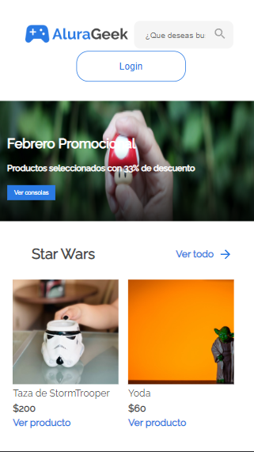

<h1 align="center" id="title"> AluraGeek </h1>
Proyecto de tienda virtual de videojuegos y relacionados, el proyecto consume un API local por medio de JSON-server, por lo tanto no se puede apreciar todo el funcionamiento al ingresar en la pagina, sin embargo se muestra el funcionamiento en un video, Segundo proyecto de la especializacion Front End en Alura Oracle Next Education  #challengeonealurageeklatam

## Tabla de Contenidos
- [AluraGeek](#title)
  - [Tabla de Contenidos](#tabla-de-contenidos)
  - [Demostraciones](#demostraciones)
  - [Tecnologias usadas](#tecnologias-usadas)
  - [Recursos Utiles](#recursos-utiles)
  - [Licencia](#licencia)
  - [Autor](#autor)
### Demostraciones
La pagina se puede ver en el link a continuacion
## [AluraGeek](https://alura-geek-tau.vercel.app/index.html) 
Las diferentes pantallas de la pagina son:
### Escritorio

### Tablet

### Celular

***
Tambien puedes ver el funcionamiento [aqui](https://youtu.be/csVnsqfg9lg)
### Tecnologias usadas
Cada uno de los proyectos ha sido desarrollado completamente en 
- HTML
- CSS
- JS
- JSON-Server
### Recursos Utiles
Durante el proceso se ha utilizado la documentacion oficial de javascript y el github de JSON-SERVER
- [Mozilla for Developers](https://developer.mozilla.org/en-US/docs/Web/HTML)
- [JSON-Server](https://github.com/typicode/json-server)
### Licencia
> This project is licensed under MIT.
### Autor
Hecho por [Miller1999](https://github.com/Miller1999)
